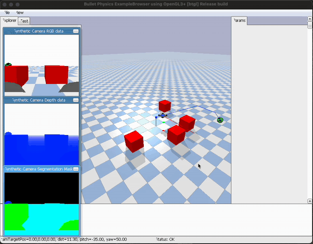

# RL-LLM Autonomous Drone Navigation
A robust autonomous navigation framework that combines LLM-based global planning with RL-based reactive collision avoidance. The system uses **Google Gemini** for long-range reasoning and a **PPO agent** for local reflexes, producing reliable navigation even in the presence of unknown, dynamic obstacles.

A **Hybrid Controller** blends the symbolic LLM plan with neural RL reflexes, while a **Geometric Watchdog** triggers re-planning if the drone is forced off-course.

## Demonstration
Watch the drone autonomously navigate a cluttered environment and react to a surprise dynamic obstacle:
<p align="center">
  <a href="https://youtu.be/5SgNZlgkMGQ" target="_blank">
    
  </a>
</p>
<p align="center">
  <i>Click the thumbnail to watch the full demonstration.</i>
</p>


## Architecture Summary

This system integrates four key components:

- **LLM Global Planner (Gemini):** Produces a geometric path (waypoints) from start to goal using obstacle-aware reasoning.
- **RL Reflex Shield (PPO):** Reads Lidar raycasts and performs millisecond-level evasive maneuvers when unexpected obstacles appear.
- **Hybrid Velocity Controller:** Blends planned motion with reflex corrections based on obstacle proximity.
- **Geometric Watchdog:** Detects when the drone deviates too far from the intended trajectory due to avoidance maneuvers. If the path ahead is obstructed, it triggers an LLM re-plan with updated obstacle information.

## System Behavior

When running the simulation, the system follows this sequence:

1.  **Initialization:** The drone spawns and requests a path from Gemini.
2.  **Cruise:** The drone follows the global path (blue line) using the geometric controller.
3.  **Ambush:** A dynamic obstacle appears directly in the flight path.
4.  **Reflex:** The RL Shield immediately takes control (red velocity vector) to avoid collision.
5.  **Recovery:** If the drone is forced off the path and cannot return, the watchdog triggers re-planning.
6.  **Re-planning:** Gemini receives the location of the new obstacle and generates a safe alternative path.
7.  **Completion:** The drone reaches the goal sphere.

## Installation & Setup

### 1. Clone the Repository
```bash
git clone https://github.com/AymaneHassini/rl-llm-autonomous-drone-navigation
cd rl-llm-autonomous-drone-navigation
```
### 2. Create a Virtual Environment 
```bash
python -m venv venv
source venv/bin/activate        # macOS/Linux
# .\venv\Scripts\activate       # Windows
```
### 3. Install Dependencies
```bash
pip install -r requirements.txt
```
### 4. RL Model Setup
Click on the [release](https://github.com/AymaneHassini/rl-llm-autonomous-drone-navigation/releases) to download the file `ppo_drone.zip` and place it in the project root directory.
Ensure the filename matches exactly:
```text
ppo_drone.zip
```
### 5. API Key Configuration
Create a `.env` file in the project root directory by copying the example file:
```bash
cp .env.example .env
```
Then, open .env and set your API key:
```bash
GEMINI_API_KEY=AIzaSyYourKeyHere...
```
### Run the Simulation

Execute the main script:
```bash
python drone-final.py
```
## Visual Debugging Guide
- **Blue Lines:** LLM-generated global path.  
- **Green Line:** Geometric controller output (Base plan).  
- **Red Line:** RL reflex output (Avoidance vector).  
- **Yellow Line:** Final blended velocity applied to the drone.

## Training the RL Agent (Optional)
If you want to retrain the reflex policy from scratch:
```bash
python train_rl.py
```
- **Algorithm:** PPO (Stable Baselines3).
- **Training Steps:** ~600,000.
- **Objective:** Short-range obstacle-aware navigation.
## License
This project is licensed under the [MIT License](LICENSE). See the LICENSE file for details.
